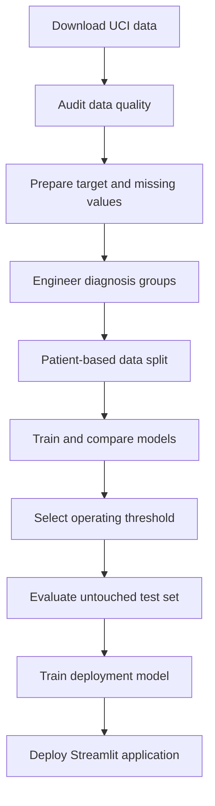

# Healthcare Readmission Prioritizer

A machine-learning prototype that estimates relative 30-day hospital readmission risk and prioritizes post-discharge follow-up.

**Live application:**  
https://healthcare-readmission-prioritizer.streamlit.app/

**GitHub repository:**  
https://github.com/shailsawant/healthcare-readmission-prioritizer

> Educational prototype only. This system is not clinically validated and must not be used for diagnosis, treatment or direct patient-care decisions.

## Problem Statement

Hospitals and caregiver-support teams have limited capacity for post-discharge follow-up.

This project assigns each hospital encounter an operational priority:

- **HIGH:** Human follow-up recommended
- **MEDIUM:** Automated guidance or secondary screening recommended
- **LOW:** Routine discharge pathway

The system is designed for workload prioritization. It does not diagnose medical conditions or recommend treatment.

## Dataset

The project uses the **Diabetes 130-US Hospitals for Years 1999–2008** dataset from the UCI Machine Learning Repository.

Dataset characteristics:

- 101,766 hospital encounters
- 71,518 patients
- 130 US hospitals and integrated delivery networks
- Data collected between 1999 and 2008
- 30-day readmission outcome
- Demographics, diagnoses, medications and previous healthcare usage

Dataset source:  
https://archive.ics.uci.edu/dataset/296/diabetes+130-us+hospitals+for+years+1999-2008

The dataset is downloaded programmatically and is not committed to this repository.

## Machine Learning Workflow



The workflow includes:

1. Downloading the public dataset through the UCI Python package
2. Auditing columns, data types, missing values and duplicate records
3. Removing expired and hospice encounters
4. Creating a binary 30-day readmission target
5. Removing columns with excessive missing data
6. Grouping detailed ICD-9 diagnosis codes into broader categories
7. Removing constant features
8. Separating patients across training, validation and test datasets
9. One-hot encoding categorical features
10. Scaling numeric features
11. Handling class imbalance
12. Comparing multiple classification algorithms
13. Selecting a recall-focused operating threshold
14. Evaluating the chosen model on an untouched final test set
15. Deploying the trained model through Streamlit

## Data Preparation

### Removed Columns

The following columns were removed because they had excessive missing data or poor availability:

- `weight`
- `payer_code`
- `medical_specialty`
- `max_glu_serum`
- `A1Cresult`

The constant columns `examide` and `citoglipton` were also removed because they contained no predictive variation.

### Diagnosis Grouping

The original diagnosis columns contained hundreds of ICD-9 codes:

- `diag_1`: 716 unique values
- `diag_2`: 748 unique values
- `diag_3`: 787 unique values

These were grouped into:

- Circulatory
- Diabetes
- Respiratory
- Digestive
- Genitourinary
- Musculoskeletal
- Neoplasm
- Injury
- Other
- Unknown

This reduced feature complexity and made the model easier to explain.

## Leakage-Safe Data Split

One patient may have multiple hospital encounters. A random row split could place encounters from the same patient in both training and testing data.

The project therefore uses `GroupShuffleSplit` with `patient_nbr` as the group.

| Dataset | Encounters | Patients | Positive Rate |
|---|---:|---:|---:|
| Training | 69,519 | 48,993 | 11.39% |
| Validation | 14,911 | 10,498 | 11.67% |
| Final test | 14,913 | 10,499 | 11.12% |

Patient overlap between all three datasets is zero.

## Models Compared

Four classification algorithms were evaluated on the same validation dataset:

| Model | Accuracy | Precision | Recall | F1 Score | ROC AUC |
|---|---:|---:|---:|---:|---:|
| Logistic Regression | 0.6765 | 0.1920 | 0.5523 | 0.2849 | 0.6675 |
| Decision Tree | 0.6159 | 0.1696 | 0.5879 | 0.2632 | 0.6426 |
| Random Forest | 0.6916 | 0.1957 | 0.5282 | 0.2855 | 0.6722 |
| Linear SVM | 0.6786 | 0.1925 | 0.5494 | 0.2852 | 0.6668 |

## Model Selection

Random Forest was selected because it produced:

- The highest ROC AUC
- The strongest overall ranking performance
- The best F1 score among the probability-producing models
- Native risk scores for threshold-based prioritization

The Decision Tree produced slightly higher recall but generated substantially more false alerts and had the weakest ROC AUC.

## Threshold Selection

The default classification threshold of `0.50` produced insufficient recall.

Thresholds were evaluated using validation data:

| Threshold | Precision | Recall | F1 Score | False Negatives |
|---:|---:|---:|---:|---:|
| 0.35 | 0.1262 | 0.9523 | 0.2229 | 83 |
| 0.40 | 0.1415 | 0.8644 | 0.2432 | 236 |
| 0.45 | 0.1648 | 0.7259 | 0.2686 | 477 |
| 0.50 | 0.1957 | 0.5282 | 0.2855 | 821 |
| 0.55 | 0.2416 | 0.3080 | 0.2708 | 1,204 |

The project uses `0.45` as the follow-up threshold because missing a potentially high-risk encounter is considered more costly than performing an unnecessary secondary review.

Priority levels:

```text
HIGH:   risk score >= 0.55
MEDIUM: risk score >= 0.45 and < 0.55
LOW:    risk score < 0.45
```

The output is called a **risk score**, not a medical probability, because the class-weighted model has not been probability-calibrated.

## Final Test Results

The final test dataset remained untouched during feature engineering, model selection and threshold selection.

It was evaluated once after the model and threshold were finalized.

| Metric | Result |
|---|---:|
| Accuracy | 0.5359 |
| Precision | 0.1554 |
| Recall | 0.7159 |
| F1 Score | 0.2554 |
| ROC AUC | 0.6668 |

### Confusion Matrix

| Actual Outcome | Predicted Low Risk | Predicted Follow-up |
|---|---:|---:|
| No 30-day readmission | 6,805 | 6,450 |
| 30-day readmission | 471 | 1,187 |

The selected threshold detected 1,187 of 1,658 readmissions.

It missed 471 readmissions and generated 6,450 false alerts.

This tradeoff is suitable for demonstrating recall-focused prioritization, but the model is not suitable for clinical deployment.

## Priority Distribution

On the final test dataset:

| Priority | Percentage |
|---|---:|
| HIGH | 14.43% |
| MEDIUM | 36.78% |
| LOW | 48.79% |

A possible operational workflow would be:

- **HIGH:** Human follow-up
- **MEDIUM:** Automated guidance or secondary screening
- **LOW:** Routine discharge process

## Technology Stack

- Python
- Pandas
- NumPy
- scikit-learn
- Random Forest
- Logistic Regression
- Decision Tree
- Linear SVM
- Joblib
- Streamlit
- UCI Machine Learning Repository
- Git and GitHub

## Project Structure

```text
healthcare-readmission-prioritizer/
├── dashboard/
│   └── app.py
├── data/
│   ├── diabetic_data.csv
│   ├── prepared_data.csv
│   ├── model_data.csv
│   ├── train_data.csv
│   ├── validation_data.csv
│   ├── test_data.csv
│   └── final_test_predictions.csv
├── models/
│   ├── model_config.json
│   └── readmission_model.joblib
├── notebooks/
├── src/
│   ├── 01_download_data.py
│   ├── 02_audit_data.py
│   ├── 03_prepare_data.py
│   ├── 04_audit_features.py
│   ├── 05_engineer_features.py
│   ├── 06_create_patient_split.py
│   ├── 07_train_logistic_regression.py
│   ├── 08_compare_models.py
│   ├── 09_tune_threshold.py
│   ├── 10_final_evaluation.py
│   └── 11_train_deployment_model.py
├── .gitignore
├── LICENSE
├── README.md
└── requirements.txt
```

The files under `data/` are generated locally and excluded from GitHub.

## Run the Application Locally

Clone the repository:

```bash
git clone https://github.com/shailsawant/healthcare-readmission-prioritizer.git
cd healthcare-readmission-prioritizer
```

Create a virtual environment:

```bash
python -m venv .venv
```

Activate it on Windows:

```powershell
.venv\Scripts\Activate.ps1
```

Install dependencies:

```bash
pip install -r requirements.txt
```

Start the Streamlit application:

```bash
streamlit run dashboard/app.py
```

## Reproduce the Machine Learning Pipeline

Run the scripts in sequence:

```bash
python src/01_download_data.py
python src/02_audit_data.py
python src/03_prepare_data.py
python src/04_audit_features.py
python src/05_engineer_features.py
python src/06_create_patient_split.py
python src/07_train_logistic_regression.py
python src/08_compare_models.py
python src/09_tune_threshold.py
python src/10_final_evaluation.py
python src/11_train_deployment_model.py
```

## Streamlit Application

The application accepts anonymous encounter attributes, including:

- Age range
- Admission type and source
- Discharge destination
- Length of hospital stay
- Number of medications
- Laboratory procedures
- Previous inpatient, outpatient and emergency visits
- Diagnosis groups
- Diabetes medication changes

The application does not request names, phone numbers, email addresses or other direct personal identifiers.

Try the application:  
https://healthcare-readmission-prioritizer.streamlit.app/

## Privacy and Safety

- The application does not request direct patient identifiers.
- Users are warned not to enter identifiable information.
- Submitted form values are not intentionally stored by the application.
- The model uses a public de-identified research dataset.
- The output is an operational prioritization signal.
- The output must not be used for diagnosis or treatment.
- Human review would be mandatory in a real healthcare deployment.

## Known Limitations

- The dataset covers US hospitals from 1999 to 2008.
- Results may not transfer to India or current healthcare systems.
- The final ROC AUC of 0.6668 indicates modest discrimination.
- Precision is low because the chosen threshold prioritizes recall.
- The risk score is not a calibrated probability.
- Diagnosis grouping removes some clinical detail.
- The project has not undergone prospective clinical validation.
- No fairness claim is made across race, gender or age groups.
- No causal relationship should be inferred from model predictions.
- The system does not integrate with a live hospital information system.

## Requirements Before Production Use

A real deployment would require:

1. Prospective clinical validation
2. Independent privacy and security review
3. Evaluation using current local hospital data
4. Fairness testing across demographic groups
5. Probability calibration
6. Clinical workflow integration
7. Human oversight and escalation procedures
8. Model monitoring and drift detection
9. Incident response and rollback procedures
10. Regulatory and legal review

## License

The project code is available under the MIT License.

The UCI dataset remains subject to its original terms and attribution requirements.

## Author

**Shailendra Sawant**

CTO and hands-on technology leader focused on scalable platforms, applied AI and production engineering.

GitHub: https://github.com/shailsawant